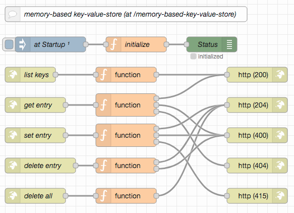
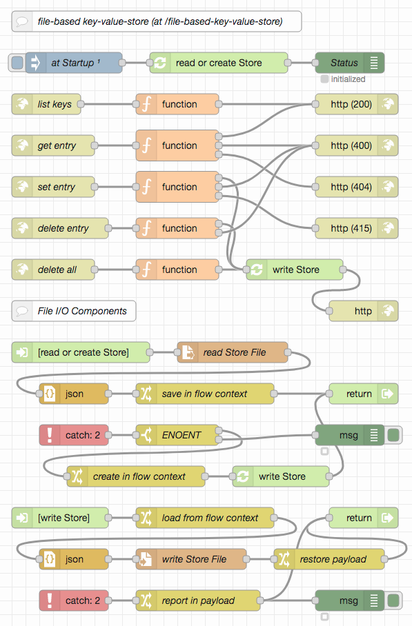

# node-red-rest-service-examples #

This collection of [Node-RED](https://nodered.org/) examples (with a matching [Postman](https://www.postman.com/) collection for testing) is mainly intended for my students, but parts of it may also be of more general interest.

It is the continuation of my other examples of [HTTP(S) servers](https://github.com/rozek/node-red-http-server-examples) and [file-based web servers](https://github.com/rozek/node-red-web-server-examples) and explains how to implement some other basic REST services using Node-RED.

For this series, it is assumed that the reader already installed Node-RED (as described in [Getting Started](https://nodered.org/docs/getting-started/)), optionally secured the editor (as shown in [Securing Node-RED](https://nodered.org/docs/user-guide/runtime/securing-node-red)) and started using it (as explained in [Creating your first flow](https://nodered.org/docs/tutorials/first-flow))

> Please note: this work is currently in progress. While it may already be used, do not expect it to be finished before end of September 2021.

### Required Extensions ###

For these examples to be run, it is necessary to install the following extension:

* [node-red-contrib-components](https://github.com/ollixx/node-red-contrib-components) "Components" allow multiply needed flows to be defined once and then invoked from multiple places

## Examples ##

All example specifications are stored in JSON format and may easily be imported into a Node-RED workspace. Preferrably, you should open a separate tab and insert them there.

To test the examples, a [Postman collection](https://raw.githubusercontent.com/rozek/node-red-rest-server-examples/main/PostmanCollection.json) is included, which may easily be imported into a running [Postman](https://www.postman.com/) instance. After the import, you should open the collection's "Variables" section and set the `BaseURL` to the base URL of your NodeRED instance (by default, it is set to `127.0.0.1:1880`, which should work out-of-the-box for most Node-RED installations). If your Node-RED instance has been configured to require basic authentication, you should also set the variables `Username` and `Password`)

Alternatively, other tools like [cURL](https://curl.se/) may be used as well.

### Memory-based Key-Value-Store ###

Currently, this service is accessible for everybody. But if you combine it with the closed web server from the [file-based web server](https://github.com/rozek/node-red-web-server-examples) examples, you may also easily create a *closed* Key-Value-Store.

### File-based Key-Value-Store ###

Currently, this service is accessible for everybody. But if you combine it with the closed web server from the [file-based web server](https://github.com/rozek/node-red-web-server-examples) examples, you may also easily create a *closed* Key-Value-Store.

### File Management ###

> For this example to work, a folder named `file-management` has to be created in the working directory of your Node-RED instance

### Dynamic Services ###

## License ##

[MIT License](LICENSE.md)
